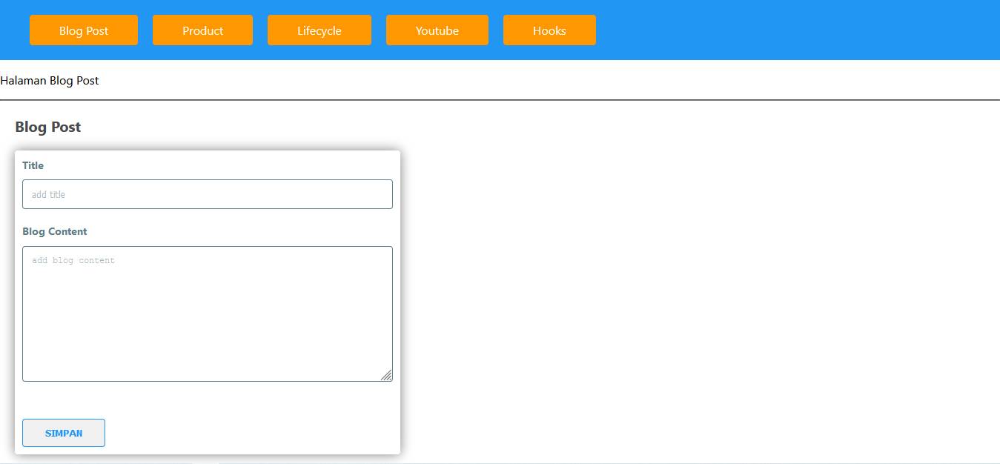

# React JS
## Screenshot Aplikasi

## Pengertian:
### React:
- A JavaScript library for building user interfaces
  - Kita bisa menghighlight bahwa react adalah javascript library yang dibuat untuk membuat
    tampilan user interfaces (UI)
  - Dengan mempelajari react pengembang sangat dimudahkan sekali dalam membuat website bahkan 
    tidak hanya dimudahkan bahkan performanya pun akan sangat baik sekali ketika menggunakan react
  - Bagaimana React Bekerja:
    - React bekerja berdasarkan dengan component (Base on component), dimana ketika kita melihat 
      sebuah website, kita
    - Mungkin bisa melihat terdapat bagian:
      - Header (header-component)
      - Banner (banner-component)
      - Article (article-component)
      - Image (img-component)
      - Footer (footer-component)
    - Disanalah react bekerja dimana react itu dibuat berdasarkan component sehingga ketika kita 
      membuat dalam component kita akan lebih spesifik dalam memperhatikan sebuah website.
    - Kita tidak akan terdistrect codingan kita atau logical terdistrect dalam satu pages, 
      karena dalam satu pages kita bisa membaginya menjadi berbagai macam component seperti yang
      dijelaskan pada pengertian pada point nomor dua, sehingga kita bisa fokus pada component 
      tersebut
    - Kita bisa memberikan logic-logic sesuai dengan yang kita inginkan
    - Kita bisa menggunakan react js sebagai javascript library untuk membuat sebuah website, 
      karena sangat populer
  - Kenapa Mengguakan React:
    - Learn Once, Write Anywhere:
      - Dimana kita hanya mempelajari satu yaitu react js dan kita bisa menggunakannya dimana 
        saja, maksudnya kita bisa menggunakannya pada website, mobile app, android, ios, bahkan 
        kita juga bisa menggunakannya di VR, kita bisa membuat satu logic dalam react dan kita 
        bisa menggunakannya dimana saja

## Keterangan lebih lanjut:
### Link: https://reactjs.org